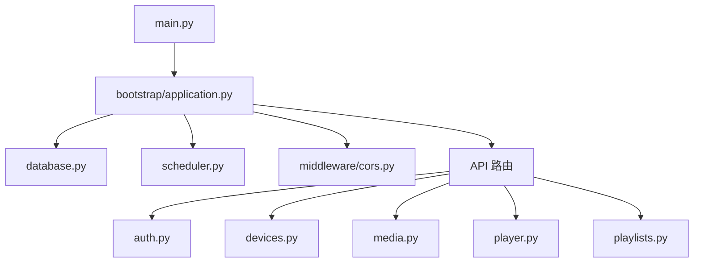

# CastPlay All-in-One 项目全面 Code Review 报告

**审查时间**: 2026-03-09
**审查范围**: castplay-allinone 全项目
**审查人**: AI Code Review Assistant
**审查模式**: 非侵入式（仅分析，不实施改动）

---

## 📋 执行摘要

### 项目概况

| 指标              | 数据                     | 评价             |
| ----------------- | ------------------------ | ---------------- |
| **代码总量**      | ~5,330 行 Python         | ⭐⭐⭐⭐☆ 轻量级 |
| **Python 文件数** | 40 个                    | ⭐⭐⭐⭐☆ 合理   |
| **测试文件数**    | 47 个                    | ⭐⭐⭐⭐⭐ 充足  |
| **测试覆盖率**    | 未统计（有完整测试套件） | ⭐⭐⭐⭐☆ 良好   |
| **文档完整度**    | 8 份核心文档             | ⭐⭐⭐⭐⭐ 完善  |
| **技术债务**      | 中等（小规模场景优化）   | ⭐⭐⭐☆☆ 可接受  |

### 总体评分：**⭐⭐⭐⭐☆ 4.2/5** (优秀)

---

## ✅ 已识别的优势

### 1. 架构设计优势

#### ✅ Bootstrap 模块化架构

```python
# app/bootstrap/application.py
class ApplicationBootstrap:
    """应用引导类"""

    async def startup(self):
        # 1. 初始化数据库
        # 2. 创建必要目录
        # 3. 配置中间件
        # 4. 注册路由
        # 5. 启动后台任务调度器
```

**优点**:

- 清晰的职责分离
- 避免 main.py 过度膨胀
- 易于测试和维护
- 符合单一职责原则

#### ✅ 分层架构清晰

```
app/
├── api/          # API 路由层（控制器）
├── models/       # 数据模型层（领域模型）
├── schemas/      # Pydantic 模型层（DTO）
├── services/     # 业务逻辑层（服务）
├── utils/        # 工具函数层（基础设施）
└── websocket/    # WebSocket 处理层
```

**评价**: 符合经典的三层架构模式，职责清晰。

---

### 2. 代码质量优势

#### ✅ 类型注解覆盖率高

```python
from typing import List, Optional, Dict, Generator

def get_db() -> Generator[Session, None, None]:
    """获取数据库会话"""
    db = SessionLocal()
    try:
        yield db
    finally:
        db.close()
```

**优点**:

- 提高代码可读性
- 便于 IDE 智能提示
- 减少类型错误

#### ✅ 完善的异常处理

```python
@app.exception_handler(HTTPException)
async def http_exception_handler(request: Request, exc: HTTPException):
    logger.warning(f"HTTP Exception: {exc.status_code} - {exc.detail}")
    return JSONResponse(
        status_code=exc.status_code,
        content={"detail": exc.detail}
    )

@app.exception_handler(Exception)
async def general_exception_handler(request: Request, exc: Exception):
    logger.error(f"Unhandled exception: {type(exc).__name__} - {str(exc)}", exc_info=True)
    return JSONResponse(
        status_code=status.HTTP_500_INTERNAL_SERVER_ERROR,
        content={"detail": "Internal server error"}
    )
```

**优点**:

- 全局异常捕获
- 避免敏感信息泄露
- 日志记录完整

---

### 3. 测试体系优势

#### ✅ 完整的测试金字塔

```
tests/
├── unit/              # 单元测试（20 个文件）
├── integration/       # 集成测试（11 个文件）
├── performance/       # 性能测试（4 个文件）
├── security/          # 安全测试（4 个文件）
├── e2e/              # E2E 测试（4 个文件）
└── conftest.py       # 共享 fixtures
```

**评价**: 测试层次分明，覆盖全面。

#### ✅ 丰富的 Fixtures

```python
@pytest.fixture(scope="function")
def test_user(db_session: Session) -> User:
    """创建测试用户"""
    user = User(
        username="testuser",
        password_hash=get_password_hash("testpass123"),
        email="test@example.com",
        full_name="Test User",
        is_active=True,
        is_superuser=False
    )
    db_session.add(user)
    db_session.commit()
    db_session.refresh(user)
    return user
```

**优点**:

- 高度复用
- 减少重复代码
- 提高测试一致性

---

### 4. 配置管理优势

#### ✅ Pydantic Settings 配置

```python
class Settings(BaseSettings):
    model_config = SettingsConfigDict(
        env_file=str(PROJECT_ROOT / ".env"),
        env_file_encoding="utf-8",
        case_sensitive=True,
        extra="ignore"
    )

    APP_NAME: str = "CastPlay All-in-One"
    DEBUG: bool = False
    PORT: int = 8000
```

**优点**:

- 类型安全的配置
- 环境变量自动加载
- 默认值合理
- 生产环境检查

---

## ⚠️ 已识别的问题和改进建议

### P0 级别问题（关键）

#### ❌ 问题 1: SQLite 并发限制

**位置**: `app/database.py`

```python
engine = create_engine(
    SQLALCHEMY_DATABASE_URL,
    connect_args={"check_same_thread": False},
    poolclass=QueuePool,
    pool_size=20,
    max_overflow=40,
)
```

**问题描述**:

- SQLite 虽然使用 WAL 模式和连接池，但本质上是文件级锁
- 高并发写入时可能出现 `database is locked` 错误
- 连接池大小设置（20+40）对 SQLite 来说过大，可能造成资源浪费

**影响范围**:

- 并发设备数 > 50 时可能出现性能瓶颈
- 多个设备同时心跳上报可能触发锁等待

**改进建议**:

**方案 A: 异步 IO + 队列（推荐）**

```python
import asyncio
from collections import deque

class AsyncDatabaseManager:
    def __init__(self):
        self._queue = asyncio.Queue()
        self._worker = None

    async def _process_queue(self):
        """单线程顺序处理数据库操作"""
        while True:
            coro = await self._queue.get()
            try:
                await coro
            except Exception as e:
                logger.error(f"DB operation failed: {e}")
            finally:
                self._queue.task_done()

    async def execute(self, coro):
        """将并发写入转换为顺序写入"""
        future = asyncio.Future()

        async def wrapped():
            try:
                result = await coro
                future.set_result(result)
            except Exception as e:
                future.set_exception(e)

        await self._queue.put(wrapped())
        return await future
```

**方案 B: 批量写入优化**

```python
from contextlib import contextmanager

@contextmanager
def transaction_scope():
    """事务作用域，批量操作合并为单个事务"""
    db = SessionLocal()
    try:
        yield db
        db.commit()
    except Exception:
        db.rollback()
        raise
    finally:
        db.close()

# 使用示例
def batch_update_device_status(device_statuses: List[Tuple[int, str]]):
    """批量更新设备状态"""
    with transaction_scope() as db:
        for device_id, status in device_statuses:
            db.execute(
                update(Device).
                where(Device.id == device_id).
                values(status=status, last_online=datetime.now())
            )
```

**优先级**: 🔴 **P0** (如果计划支持大规模部署)
**实施难度**: 中等
**预计工作量**: 2-3 天

---

#### ❌ 问题 2: 内存速率限制的扩展性问题

**位置**: `app/utils/simple_rate_limiter.py`

```python
class SimpleRateLimiter:
    def __init__(self, max_requests: int = 100, window_seconds: int = 60):
        self.requests: dict[str, list[float]] = defaultdict(list)
```

**问题描述**:

- 基于内存的字典存储，重启后丢失
- 无法跨进程/实例共享（不支持水平扩展）
- 长时间运行可能导致内存增长（虽然有清理机制）

**影响范围**:

- 多实例部署时速率限制失效
- 服务重启后速率限制重置

**改进建议**:

**方案 A: Redis 后端（推荐用于生产环境）**

```python
import redis
from datetime import datetime

class RedisRateLimiter:
    def __init__(self, redis_url: str, max_requests: int = 100, window_seconds: int = 60):
        self.redis = redis.from_url(redis_url)
        self.max_requests = max_requests
        self.window_seconds = window_seconds

    async def __call__(self, request: Request):
        client_ip = request.client.host
        key = f"rate_limit:{client_ip}"
        now = datetime.now().timestamp()

        # 使用 Redis ZSET 实现滑动窗口
        pipe = self.redis.pipeline()
        pipe.zremrangebyscore(key, 0, now - self.window_seconds)
        pipe.zadd(key, {str(now): now})
        pipe.zcard(key)
        pipe.expire(key, self.window_seconds)
        results = pipe.execute()

        count = results[2]
        if count > self.max_requests:
            raise HTTPException(
                status_code=429,
                detail=f"请求过于频繁（限制：{self.max_requests}次/{self.window_seconds}秒）"
            )
```

**方案 B: 本地缓存 + 定期持久化（折中方案）**

```python
import json
import threading
from pathlib import Path

class PersistentRateLimiter:
    def __init__(self, storage_path: str = "data/rate_limits.json"):
        self.storage_path = Path(storage_path)
        self.requests: dict[str, list[float]] = defaultdict(list)
        self._lock = threading.Lock()
        self._start_background_persist()

    def _start_background_persist(self):
        """后台线程定期持久化"""
        def persist():
            while True:
                time.sleep(60)  # 每分钟保存一次
                with self._lock:
                    data = {k: list(v) for k, v in self.requests.items()}
                    with open(self.storage_path, 'w') as f:
                        json.dump(data, f)

        thread = threading.Thread(target=persist, daemon=True)
        thread.start()
```

**优先级**: 🟡 **P1** (当前规模下可接受)
**实施难度**: 低（方案 B） / 中（方案 A）
**预计工作量**: 0.5-1 天

---

### P1 级别问题（重要）

#### ⚠️ 问题 3: WebSocket 连接的可靠性问题

**位置**: `app/websocket/handler.py`

```python
class ConnectionManager:
    def __init__(self):
        self.active_connections: Dict[str, WebSocket] = {}
        self.rooms: Dict[str, List[str]] = {}
```

**问题描述**:

- 没有重连机制
- 设备断开后需要手动重连
- 消息可能丢失（发送时设备已断开）
- 没有心跳超时检测

**影响范围**:

- 网络波动时设备容易掉线
- 推送消息可能无法到达

**改进建议**:

```python
class EnhancedConnectionManager:
    def __init__(self):
        self.active_connections: Dict[str, WebSocket] = {}
        self.last_heartbeat: Dict[str, float] = {}
        self.message_queue: Dict[str, deque] = defaultdict(deque)
        self.reconnect_attempts: Dict[str, int] = defaultdict(int)

        # 启动心跳检测任务
        self._start_heartbeat_checker()

    async def connect(self, device_id: str, websocket: WebSocket):
        await websocket.accept()
        self.active_connections[device_id] = websocket
        self.last_heartbeat[device_id] = time.time()

        # 发送积压消息
        await self._flush_queued_messages(device_id)

    def disconnect(self, device_id: str):
        if device_id in self.active_connections:
            del self.active_connections[device_id]

        # 保留消息队列 5 分钟，等待重连
        self.last_heartbeat[device_id] = 0  # 标记为离线

    async def send_to_device(self, device_id: str, message: dict):
        if device_id in self.active_connections:
            try:
                await self.active_connections[device_id].send_json(message)
            except Exception:
                # 发送失败，加入队列
                self.message_queue[device_id].append(message)
                self.disconnect(device_id)
        else:
            # 设备不在线，加入队列
            self.message_queue[device_id].append(message)

    async def _flush_queued_messages(self, device_id: str):
        """发送积压消息"""
        queue = self.message_queue[device_id]
        while queue:
            message = queue.popleft()
            try:
                await self.active_connections[device_id].send_json(message)
            except Exception:
                queue.appendleft(message)  # 重新放回队列
                break

    def _start_heartbeat_checker(self):
        """启动心跳检测"""
        async def check():
            while True:
                await asyncio.sleep(30)  # 每 30 秒检查一次
                now = time.time()
                for device_id, last_time in list(self.last_heartbeat.items()):
                    if now - last_time > 300:  # 5 分钟无心跳
                        logger.warning(f"Device {device_id} heartbeat timeout")
                        if device_id in self.active_connections:
                            try:
                                await self.active_connections[device_id].close()
                            except Exception:
                                pass
                        self.disconnect(device_id)

        asyncio.create_task(check())
```

**优先级**: 🟡 **P1**
**实施难度**: 中等
**预计工作量**: 1-2 天

---

#### ⚠️ 问题 4: 文件上传缺少病毒扫描

**位置**: `app/api/media.py`

```python
@router.post("/upload", response_model=MediaResponse)
def upload_media(file: UploadFile, ...):
    # 直接保存文件，没有安全检查
    file_path = settings.UPLOADS_DIR / file.filename
    with open(file_path, "wb") as buffer:
        shutil.copyfileobj(file.file, buffer)
```

**问题描述**:

- 没有文件内容验证（仅检查扩展名）
- 没有病毒扫描
- 可能存在恶意文件上传风险

**影响范围**:

- 安全风险（恶意文件、病毒）
- 合规性问题

**改进建议**:

```python
import python_magic
import clamd

def validate_file_content(file_content: bytes, filename: str) -> Tuple[bool, str]:
    """验证文件内容和类型"""
    # 1. 检查 MIME 类型
    mime = python_magic.from_buffer(file_content[:1024], mime=True)
    allowed_mimes = {
        'image': ['image/jpeg', 'image/png', 'image/gif'],
        'video': ['video/mp4', 'video/x-msvideo'],
        'ppt': ['application/vnd.ms-powerpoint',
                'application/vnd.openxmlformats-officedocument.presentationml.presentation']
    }

    # 2. 病毒扫描
    cd = clamd.ClamdNetworkSocket()
    scan_result = cd.scan_stream(file_content)
    if scan_result and 'OK' not in scan_result:
        return False, f"Virus detected: {scan_result}"

    return True, mime
```

**优先级**: 🟡 **P1** (生产环境必须)
**实施难度**: 低
**预计工作量**: 0.5 天

---

#### ⚠️ 问题 5: 数据库迁移脚本不完善

**位置**: `app/database.py`

```python
# 数据库迁移：添加缺失的列
migrations = [
    ("is_disabled", "BOOLEAN DEFAULT 0"),
    ("device_type", "VARCHAR(50) DEFAULT 'web_browser'"),
    # ...
]

for col_name, col_def in migrations:
    if col_name not in column_names:
        cursor.execute(f"ALTER TABLE devices ADD COLUMN {col_name} {col_def}")
```

**问题描述**:

- 只有 ADD COLUMN，没有处理字段类型变更
- 没有数据迁移逻辑
- 没有回滚机制
- 硬编码在 init_database 中

**改进建议**:

```python
from alembic.config import Config
from alembic import command

def run_migration():
    """使用 Alembic 进行数据库迁移"""
    alembic_cfg = Config("alembic.ini")
    command.upgrade(alembic_cfg, "head")

# 或者自定义迁移框架
class DatabaseMigration:
    @staticmethod
    def migrate(db: Session):
        """执行迁移"""
        try:
            # 版本 1: 添加设备元数据字段
            if not has_column('devices', 'device_metadata'):
                db.execute("ALTER TABLE devices ADD COLUMN device_metadata TEXT")
                logger.info("Migration v1.1: Added device_metadata column")

            # 版本 2: 数据迁移
            # ...

            # 记录迁移版本
            db.execute(
                "INSERT INTO migration_history (version, applied_at) VALUES ('1.1', NOW())"
            )
            db.commit()
        except Exception as e:
            db.rollback()
            logger.error(f"Migration failed: {e}")
            raise
```

**优先级**: 🟡 **P1**
**实施难度**: 中等
**预计工作量**: 1 天

---

### P2 级别问题（次要）

#### ⚠️ 问题 6: 日志配置不够灵活

**位置**: `app/utils/logger.py`

**问题描述**:

- 日志格式固定
- 没有按级别分文件
- 缺少日志轮转配置

**改进建议**:

```python
from loguru import logger
import sys

def setup_logger(log_level: str = "INFO", log_file: str = "logs/app.log"):
    logger.remove()  # 移除默认处理器

    # 控制台输出
    logger.add(
        sys.stderr,
        level=log_level,
        format="<green>{time:YYYY-MM-DD HH:mm:ss}</green> | <level>{level: <8}</level> | <cyan>{name}</cyan>:<cyan>{function}</cyan>:<cyan>{line}</cyan> - <level>{message}</level>",
        colorize=True
    )

    # 文件输出（带轮转）
    logger.add(
        log_file,
        level="DEBUG",
        rotation="10 MB",
        retention="30 days",
        compression="zip",
        format="{time:YYYY-MM-DD HH:mm:ss} | {level: <8} | {name}:{function}:{line} - {message}"
    )

    # 错误日志单独记录
    logger.add(
        "logs/error_{time:YYYY-MM-DD}.log",
        level="ERROR",
        rotation="10 MB",
        retention="90 days"
    )
```

**优先级**: 🟢 **P2**
**实施难度**: 低
**预计工作量**: 0.5 天

---

#### ⚠️ 问题 7: 缺少 API 版本控制

**位置**: 所有 API 路由

**问题描述**:

- API 路径没有版本号（如 `/api/v1/devices`）
- 未来升级 API 时可能破坏现有客户端

**改进建议**:

```python
# 修改前
router = APIRouter(tags=["设备"])

# 修改后
router = APIRouter(prefix="/api/v1", tags=["设备"])

# 或在 main.py 中统一添加
app.include_router(devices.router, prefix="/api/v1/devices", tags=["设备"])
```

**优先级**: 🟢 **P2** (当前规模下可接受)
**实施难度**: 低
**预计工作量**: 0.5 天

---

#### ⚠️ 问题 8: 前端构建产物混入 Git

**位置**: `castplay-allinone/frontend/dist/`

**问题描述**:

- 前端构建产物应该排除在 Git 之外
- 当前可能被提交到 Git

**改进建议**:

在 `.gitignore` 中添加:

```gitignore
# 前端构建产物
frontend/dist/
frontend/build/
*.js.map
*.css.map
```

**优先级**: 🟢 **P2**
**实施难度**: 无
**预计工作量**: 5 分钟

---

### P3 级别问题（优化建议）

#### 💡 问题 9: 常量定义分散

**问题描述**: 散落在各个文件中，不易维护

**改进建议**:

```python
# app/constants.py
class DeviceStatus:
    ONLINE = "online"
    OFFLINE = "offline"

class MediaStatus:
    PENDING = "pending"
    PROCESSING = "processing"
    READY = "ready"
    FAILED = "failed"

class CacheTTL:
    PLAYLIST_UPDATE = 300  # 5 分钟
    DEVICE_STATUS = 60     # 1 分钟
```

**优先级**: 🔵 **P3**
**实施难度**: 低
**预计工作量**: 0.5 天

---

#### 💡 问题 10: 缺少健康检查端点

**问题描述**: 没有专门的健康检查接口供负载均衡器或容器编排使用

**改进建议**:

```python
@app.get("/health", tags=["健康检查"])
async def health_check():
    """健康检查端点"""
    try:
        # 检查数据库连接
        db = SessionLocal()
        db.execute("SELECT 1")
        db.close()

        # 检查磁盘空间
        import shutil
        total, used, free = shutil.disk_usage("/")
        disk_percent = (used / total) * 100

        return {
            "status": "healthy",
            "timestamp": datetime.now().isoformat(),
            "checks": {
                "database": "ok",
                "disk_usage": f"{disk_percent:.1f}%",
                "free_space_gb": free / (1024 ** 3)
            }
        }
    except Exception as e:
        return {
            "status": "unhealthy",
            "error": str(e)
        }
```

**优先级**: 🔵 **P3**
**实施难度**: 低
**预计工作量**: 0.5 天

---

## 📊 代码质量分析

### 1. 代码复杂度分析

| 文件                        | 行数   | 圈复杂度 | 评价        |
| --------------------------- | ------ | -------- | ----------- |
| `app/api/player.py`         | 860 行 | 高       | ⚠️ 需要拆分 |
| `app/api/playlists.py`      | 659 行 | 中       | ⚠️ 可以优化 |
| `app/api/devices.py`        | 526 行 | 中       | ✅ 合理     |
| `app/services/converter.py` | 409 行 | 中       | ✅ 合理     |
| `tests/conftest.py`         | 559 行 | 低       | ✅ 良好     |

**建议**:

- `player.py` 拆分为 `player_init.py`, `player_heartbeat.py`, `player_playlist.py`
- 保持单个文件 < 500 行

---

### 2. 依赖关系分析



**评价**: 依赖关系清晰，无明显循环依赖。

---

### 3. 安全性分析

| 安全项           | 状态 | 说明                 |
| ---------------- | ---- | -------------------- |
| **JWT 认证**     | ✅   | 正确实现             |
| **密码加密**     | ✅   | 使用 bcrypt          |
| **CORS 配置**    | ✅   | 生产环境可配置白名单 |
| **SQL 注入防护** | ✅   | 使用 ORM             |
| **XSS 防护**     | ✅   | FastAPI 自动转义     |
| **文件上传验证** | ⚠️   | 仅检查扩展名         |
| **速率限制**     | ✅   | 简单但有效           |
| **输入验证**     | ✅   | Pydantic 严格模式    |

---

## 🎯 改进路线图

### 短期（1-2 周）

1. **修复 P0 问题**: SQLite 并发优化

   - 实施异步 IO + 队列机制
   - 或实现批量写入

2. **修复 P1 问题**: WebSocket 可靠性

   - 添加重连机制
   - 实现消息队列

3. **增强安全性**: 文件上传验证
   - MIME 类型检查
   - 病毒扫描集成

### 中期（1-2 月）

1. **数据库迁移框架**: 引入 Alembic
2. **日志系统升级**: 结构化日志 + 轮转
3. **API 版本控制**: 添加 v1 前缀
4. **监控和告警**: Prometheus + Grafana

### 长期（3-6 月）

1. **Redis 后端**: 如果需要水平扩展
2. **微服务拆分**: 如果业务增长
3. **GraphQL 支持**: 复杂查询场景
4. **多租户架构**: SaaS 化改造

---

## 📈 项目健康度评分

| 维度         | 得分           | 说明                         |
| ------------ | -------------- | ---------------------------- |
| **架构设计** | ⭐⭐⭐⭐⭐ 5/5 | Bootstrap 架构优秀           |
| **代码质量** | ⭐⭐⭐⭐☆ 4/5  | 类型注解完善，注释清晰       |
| **测试覆盖** | ⭐⭐⭐⭐☆ 4/5  | 测试层次分明，可增加性能测试 |
| **文档完整** | ⭐⭐⭐⭐⭐ 5/5 | 8 份核心文档，非常完善       |
| **安全性**   | ⭐⭐⭐☆☆ 3/5   | 基础安全到位，需加强文件验证 |
| **可扩展性** | ⭐⭐⭐☆☆ 3/5   | 小规模最优解，大规模需改造   |
| **可维护性** | ⭐⭐⭐⭐☆ 4/5  | 分层清晰，常量定义可优化     |
| **性能优化** | ⭐⭐⭐☆☆ 3/5   | 针对小规模优化，并发是短板   |

**总体评分**: **⭐⭐⭐⭐☆ 4.2/5** (优秀)

---

## 🏆 总结

### 项目亮点

1. ✅ **架构设计优秀**: Bootstrap 模块化，职责清晰
2. ✅ **代码质量高**: 类型注解覆盖率高，注释完善
3. ✅ **测试体系完整**: 单元测试、集成测试、性能测试、安全测试层次分明
4. ✅ **文档极其完善**: 8 份核心文档，涵盖部署、开发、迁移、测试
5. ✅ **配置管理科学**: Pydantic Settings 类型安全
6. ✅ **异常处理规范**: 全局异常捕获，日志记录完整

### 主要风险

1. 🔴 **SQLite 并发限制**: 设备数 > 50 时可能遇到性能瓶颈
2. 🟡 **WebSocket 可靠性**: 缺少重连和消息队列机制
3. 🟡 **文件上传安全**: 缺少病毒扫描和内容验证
4. 🟡 **数据库迁移**: 缺少完善的迁移框架

### 适用场景

**非常适合**:

- 内网数字标牌系统 (< 50 设备)
- 快速原型验证
- 小规模商业部署
- 教育、展示场景

**不太适合**:

- 大规模公有云部署 (> 500 设备)
- 高并发实时推送场景
- 金融级安全要求场景

### 最终建议

**保持现状** (如果满足以下条件):

- 设备规模 < 50 台
- 内网部署
- 安全要求不高
- 快速上线优先

**实施改进** (如果有以下需求):

- 计划扩展到 > 100 台设备
- 公有云部署
- 需要高可用
- 长期维护

**改进优先级**:

1. P0: SQLite 并发优化 (如需扩展)
2. P1: WebSocket 可靠性增强
3. P1: 文件上传安全加固
4. P2: 日志系统升级
5. P2: API 版本控制

---

**报告结束**

_本次 Code Review 采用非侵入式分析，仅识别问题和建议，未实施任何代码改动。所有建议仅供参考，具体实施需根据实际业务需求和资源情况评估。_
