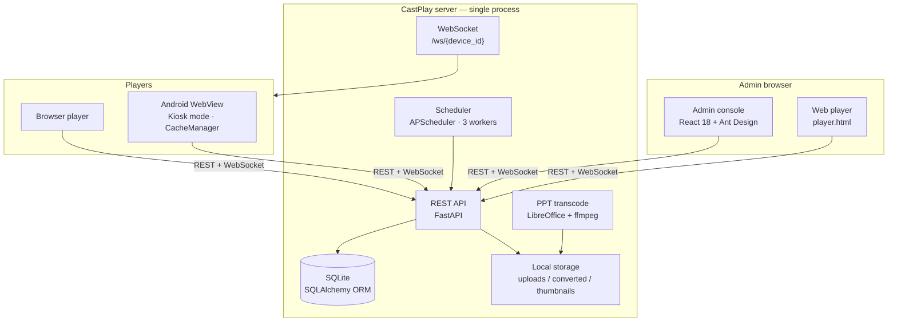

<div align="center">

# 🖥️ CastPlay All-in-One


**Single-container digital signage — up in 10 seconds. One web console to manage devices, upload media and push playlists.**

`Upload media` → `Arrange playlists` → `Push to devices` → `screens sync within 2 seconds`

[](LICENSE)
[](https://github.com/davyzhong/CastPlay/releases)
[](https://www.python.org)
[](Dockerfile)
[](https://fastapi.tiangolo.com)
[](https://react.dev)
[](android/)
[](SECURITY.md)

[中文](./README.md) · **[English](./README.en.md)**

[Quick start](#-quick-start) · [Install](#-install) · [Architecture](#-architecture) · [API](#-api) · [Android player](#-android-player) · [Comparison](#-comparison) · [Contributing](#-contributing)

</div>

---

> 📸 Screenshots auto-generated by GitHub Actions (FastAPI /docs + React admin capture is a planned v3.1 upgrade — `scripts/screenshot.js` + `.github/workflows/screenshot.yml`)

> One process runs the whole stack: admin UI + REST + WebSocket, multi-format media (including PPT), and a kiosk-mode Android client. No Redis, no Celery, no separate database.

---

## ✨ Why CastPlay

- **🚀 Single container, zero external dependencies** — `docker run castplay` brings up the admin UI + API + WebSocket together. No Redis, no Celery, no standalone database service.
- **🖼️ Multi-format media, PPT included** — drop in a `.pptx` and the server transcodes it to video via LibreOffice + ffmpeg, preserving the original slide animations.
- **📡 Real-time push to every screen** — playlists and schedules fan out over WebSocket; clients apply changes in ≈ 2 seconds with no polling.
- **📱 Kiosk-locked Android player** — `MainActivity.kt` is a WebView with `DevicePolicyManager` lock-down mode; the device can only ever show what you push.
- **📅 Scheduling + time zones** — per-device daily on/off windows, multi-time-zone support, automatic fallback to the default playlist.
- **🔍 Optimized for < 50 screens** — SQLite persistence, APScheduler, 3 worker threads. At this scale, Redis/Celery/PG would be over-engineering.

---

## 🚀 Quick start

### 30 seconds — try it with Docker

```bash
docker run -d \
  --name castplay \
  -p 8000:8000 \
  -v castplay-data:/app/data \
  ghcr.io/davyzhong/castplay:latest
# Or build locally:
# docker build -t castplay:latest . && docker compose up -d
```

Open <http://localhost:8000/> for the admin console and <http://localhost:8000/player.html> for the web-player preview.

### 60 seconds — from source (no Docker)

```bash
# 1. Clone
git clone https://github.com/davyzhong/CastPlay.git
cd CastPlay

# 2. System dependencies (Ubuntu/Debian package names)
sudo apt-get update && sudo apt-get install -y libreoffice ffmpeg

# 3. Backend
python -m venv .venv && source .venv/bin/activate
pip install -r requirements.txt
python scripts/init_db.py

# 4. Frontend (for local dev; prebuilt assets are committed)
cd frontend && npm install && npm run build && cd ..

# 5. Run
python scripts/run.py
# or: make dev
```

- **Admin console** → <http://localhost:8000/>
- **Web player** → <http://localhost:8000/player.html>
- **OpenAPI docs** → <http://localhost:8000/docs>

### Default account

First launch seeds:

```
username: admin
password: changeme    # override via .env in production
```

> See the hardening checklist in [`docs/deployment/guide.md`](docs/deployment/guide.md).

---

## 📸 What it looks like

> ⚠️ Real screenshots are `[TODO]` placeholders. Capture them into `docs/screenshots/` once running and the placeholders will be replaced.

### Admin console

<p align="center">
  <a href="docs/screenshots/dashboard.png"></a>
  <a href="docs/screenshots/playlists.png"></a>
</p>
<p align="center"><sub><em>[TODO: dashboard.png] · [TODO: playlists.png]</em></sub></p>

### Media library + Android player

<p align="center">
  <a href="docs/screenshots/media.png"></a>
  <a href="docs/screenshots/android-player.png"></a>
</p>
<p align="center"><sub><em>[TODO: media.png] · [TODO: android-player.png]</em></sub></p>

---

## 🏗️ Architecture



**Push path**: admin → `POST /api/playlists/{id}/devices/{deviceId}` → WebSocket fan-out → connected clients receive a diff and rebuild their local playlist.

---

## 📦 Features

### 🖼️ Media management

- 🧩 **Multi-format support** — JPG/PNG/GIF images, MP4/AVI/MOV video, PPT/PPTX slides.
- 🎞️ **PPT → video pipeline** — LibreOffice to PDF, Poppler to page images, ffmpeg stitched into MP4.
- 🔁 **Per-file retry** — failed transcodes get a one-click retry in the admin UI (`POST /api/media/{id}/retry`).
- 🔍 **Content validation** — extension + magic-number double check; mismatches never touch disk.
- 🖼️ **Thumbnail generation** — Pillow builds previews for images and PPT cover slides.

### 📋 Playlists & devices

- 🎯 **Drag-and-drop ordering** — the admin uses `@dnd-kit`; order persists via `PUT /api/playlists/{id}/items/reorder`.
- 📡 **≈ 2-second sync** — changes go down over WebSocket; no device polling.
- 🎚️ **Per-item duration** — configure how long each item plays; 8 seconds by default.
- 🎞️ **Web player simulator** — preview an entire playlist in the browser before assigning it (`/player.html`).
- 📅 **Schedule-aware** — per-device daily on/off windows, time zones, automatic fallback to the default playlist.

### 🛡️ Operations

- 🖥️ **Device registry** — keyed by MAC address; `registration_code` serves as the production token credential.
- 🔐 **JWT + bcrypt** — token rotation via `/api/auth/refresh`; rotate `SECRET_KEY` in `.env`.
- 🧹 **Self-cleaning storage** — Android `CacheManager.kt` proactively reclaims space before it fills.
- 🚦 **3-worker scheduler** — concurrency cap for PPT transcoding and schedule evaluation.
- 🔁 **Auto-reconnect** — devices recover after network drops; WebSocket heartbeats keep connections alive.

### 📱 Players

- 🌐 **Browser player** — `frontend/player.html` runs the same code as the Android WebView.
- 🤖 **Android player** — `MainActivity.kt` hosts a WebView with `DevicePolicyManager` lock-down and an offline-first `CacheManager.kt`.

---

## 🔧 Install

### 1. System prerequisites

| Tool | Purpose | Version check |
|---|---|---|
| Python | Backend | 3.10+ |
| Node.js | Frontend dev mode | 18+ |
| LibreOffice | PPT → PDF | 7+ |
| ffmpeg | Media stitching | 4.4+ |
| Docker (optional) | One-shot deploy | 24+ |

### 2. Install paths

#### Docker (recommended)

```bash
docker compose up -d             # uses docker-compose.yml
# or
docker build -t castplay . && docker run -d -p 8000:8000 -v castplay-data:/app/data castplay
```

#### Pip + npm (developer mode)

```bash
# Backend
python -m venv .venv && source .venv/bin/activate
pip install -r requirements.txt
python scripts/init_db.py
python scripts/run.py

# Frontend (optional — prebuilt assets ship in the repo)
cd frontend && npm install && npm run dev
```

#### Make (developer shortcuts)

```bash
make install          # pip + npm install
make dev              # backend + frontend in parallel
make test             # pytest
make lint             # black + isort + mypy + pylint
make docker-build     # build the image
make docker-run       # docker compose up
```

### 3. Configuration

CastPlay reads environment variables (`.env` file or container env):

```bash
DATABASE_PATH=/app/data/castplay.db   # SQLite path
SECRET_KEY=...                        # JWT signing key
DEBUG=false                           # verbose logs off in production
NUM_WORKERS=3                         # APScheduler thread pool size
ENVIRONMENT=production                # tightens auth when set to production
```

> Full reference: [`docs/deployment/guide.md`](docs/deployment/guide.md) and `.env.example`.

---

## 🌐 API

REST routes mount under `/api/`. Browse OpenAPI at `/docs` (Swagger UI) and `/redoc`.

| Group | Endpoints (selection) | Notes |
|---|---|---|
| **Auth** | `POST /auth/token`, `POST /auth/refresh`, `GET /auth/me` | JWT bearer |
| **Devices** | `POST /devices/register`, `GET /devices`, `PUT /devices/{id}/disable`, `* /schedule` | MAC-keyed registry |
| **Media** | `POST /media/upload`, `GET /media`, `DELETE /media/{id}`, `POST /media/{id}/retry` | multipart upload + thumbnails |
| **Playlists** | `POST /playlists`, `* /items`, `PUT /items/reorder`, `POST /playlists/{id}/devices/{deviceId}` | drag-order persisted |
| **Schedules** | `GET/PUT /devices/{id}/schedule` | per-device daily on/off windows |
| **Player** | `GET /playlists/{deviceId}`, `GET /config/{deviceId}`, `POST /status/{deviceId}` | client read side |
| **WebSocket** | `WS /ws/{deviceId}` | playlist diff + heartbeat |

> Full schema: open <http://localhost:8000/docs> after starting.

---

## 📱 Android player

The Android player is a Kotlin shell around the same web-player code:

- **WebView host** — [`MainActivity.kt`](android/app/src/main/java/com/castplay/player/MainActivity.kt) loads the web player and injects the runtime `deviceId`.
- **Kiosk mode** — `MyDeviceAdminReceiver.kt` + `DevicePolicyManager` lock the device down; `BootReceiver.kt` restarts the player at boot.
- **Offline cache** — `CacheManager.kt` pre-downloads assigned playlist media, verifies MD5, retries up to 3 times with exponential backoff.
- **JsBridge** — exposes MAC, IP, registration code, download progress and network state to the WebView.

Build:

```bash
# Default backend address (edit android/app/build.gradle.kts to change)
./build-android.sh

# Or point at your own server:
./build-android.sh http://192.168.1.100:8000
```

Artifact: `android/app/build/outputs/apk/debug/app-debug.apk` (about 20–30 MB).

> Detailed Android flow: docs/android/deployment_guide.md (pending).

---

## 🆚 Comparison

| Metric | CastPlay 2.0 | CastPlay v1 (legacy) | Commercial CMS |
|---|---|---|---|
| External deps (Redis/Celery/PG) | **none** | required | required |
| First deploy on a clean VM | **5 minutes** | 30 minutes | 30+ minutes |
| Cold start | **≈ 10 seconds** | ≈ 2 minutes | ≈ 30 seconds |
| Python source files | **36** | 79 | n/a |
| Code size vs v1 | **−34%** | baseline | n/a |
| Target fleet size | **< 50 screens** | small–medium | medium–large |
| License | **MIT** | per-seat | subscription |
| WebSocket push (no polling) | ✅ | ✅ | ✅ |

---

## 🗓️ Roadmap

- [x] **v2.0** — bootstrap architecture; zero external deps; 3-worker scheduler; drag-order playlists; WebSocket push; Android kiosk player.
- [ ] **v2.1** — optional Postgres + Redis adapters (for 50+ screen fleets, compatible with the legacy setup).
- [ ] **v2.2** — multi-user roles (admin / editor / viewer) with per-device permission granularity.
- [ ] **v2.3** — weather, RSS and live-data widgets in playlists.
- [ ] **v2.4** — tvOS player on Apple TV.

> Latest code review: [`docs/reports/PROJECT_REVIEW_REPORT.md`](docs/reports/PROJECT_REVIEW_REPORT.md); review follow-ups tracked in OPTIMIZATION.md (pending).

---

## 🧪 Testing

```bash
# Everything
make test                            # = pytest tests/ -v

# By group
make test-unit                       # pytest -m unit
make test-integration                # pytest -m integration
make test-e2e                        # frontend E2E
make test-performance                # Locust, 100 users / 60 seconds

# Coverage
make test-coverage                   # htmlcov/index.html + coverage.xml
```

CI expectations: [`docs/testing/`](docs/testing/).

---

## 🤝 Contributing

PRs welcome. Please read [`CLAUDE.md`](CLAUDE.md) first for build/test conventions. High-leverage contributions:

- **Bug reports** — include OS, CastPlay version, `docker compose ps` output, and excerpts from `logs/`.
- **Translations** — `frontend/src/locales/` already carries `zh-CN` + `en-US`; add a locale and ping the maintainer.
- **API patches** — write the test in `tests/integration/` first; the OpenAPI spec at `/docs` regenerates from code.
- **Android fixes** — spin up an emulator per [`docs/android/emulator_setup.md`](docs/android/emulator_setup.md).

This project follows the spirit of the [Contributor Covenant v2.1](https://www.contributor-covenant.org/version/2/1/code_of_conduct/).

---

## 🔒 Security

Report vulnerabilities privately — **do not open a public GitHub issue**. See [`SECURITY.md`](SECURITY.md) for the supported-version table, disclosure window and private contact channel.

CastPlay's security posture:

- **JWT bearer auth** — rotate `SECRET_KEY` in `.env`; short-lived tokens with a refresh path.
- **`registration_code` token** — in production mode (`ENVIRONMENT=production`), every WebSocket connection must present the registration code; codes `4001`/`4003`/`4004` reject unauthorized clients.
- **WebSocket origin allowlist** — production mode only accepts admin hosts from the configuration.
- **Hard defaults** — `DEBUG=false`, `NUM_WORKERS=3`, no telemetry, no third-party CDNs.
- **Content validation** — uploads check extension first, then magic number, before anything is written to disk.

---

## ⚖️ Legal

Open-sourced under the [MIT License](LICENSE); ships without any third-party sample media — bring your own.

---

<div align="center">

<sub>📌 CastPlay is maintained by <a href="https://github.com/davyzhong">qiming</a> · <a href="https://github.com/davyzhong/CastPlay/issues">🐛 Report a bug</a> · <a href="https://github.com/davyzhong/CastPlay/discussions">💬 Discussions</a></sub>

</div>
