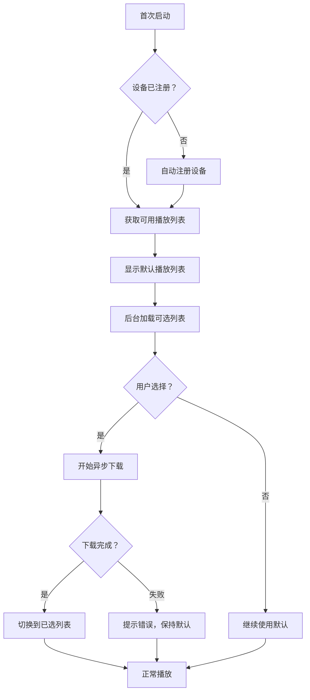

# 播放端功能增强设计方案

**版本：** v1.0
**创建日期：** 2026-01-03
**需求方：** 产品经理
**技术负责人：** TBD

---

## 📋 目录

1. [需求概述](#1-需求概述)
2. [详细设计](#2-详细设计)
3. [技术方案](#3-技术方案)
4. [数据库设计](#4-数据库设计)
5. [API 设计](#5-api 设计)
6. [前端实现](#6-前端实现)
7. [测试计划](#7-测试计划)
8. [风险评估](#8-风险评估)

---

## 1. 需求概述

### 1.1 需求背景

随着 CastPlay 系统部署规模扩大（约 50 个播放端），用户对播放端的管理和体验提出了更高要求：

- **运维需求：** 需要快速识别和定位设备
- **用户体验：** 首次使用需要更友好的播放列表选择
- **稳定性：** 播放列表更新不应影响当前播放
- **管理需求：** 清晰的设备监控视图

### 1.2 需求清单

| 编号    | 需求名称                        | 优先级 | 复杂度 | 工期估算 |
| ------- | ------------------------------- | ------ | ------ | -------- |
| REQ-001 | 播放端设备 ID 低可视度展示      | P1     | 低     | 0.5 天   |
| REQ-002 | 首次安装播放列表选择 + 异步下载 | P0     | 中     | 2 天     |
| REQ-003 | 播放列表变更后台异步下载        | P0     | 高     | 3 天     |
| REQ-004 | 设备管理页面只读监控化          | P1     | 中     | 1.5 天   |

**总工期：** 7 人天

### 1.3 用户故事

#### REQ-001: 设备 ID 展示

> **作为** 运维人员
> **我希望** 在播放端页面右下角看到设备 ID
> **以便于** 快速识别和定位当前设备
> **但不希望** 过于明显影响观看体验

#### REQ-002: 首次安装配置

> **作为** 新用户
> **我希望** 首次安装时可以选择想要的播放列表
> **并且** 在下载过程中不影响默认播放
> **以便于** 尽快开始使用，无需等待下载完成

#### REQ-003: 无感更新

> **作为** 播放端用户
> **我希望** 播放列表更新时在后台下载
> **并且** 下载完成后平滑切换
> **而不希望** 当前播放被打断

#### REQ-004: 设备监控

> **作为** 管理员
> **我希望** 清晰查看所有播放端的状态
> **但不能** 在服务端随意增删设备
> **以确保** 数据的真实性和可靠性

---

## 2. 详细设计

### 2.1 REQ-001: 设备 ID 低可视度展示

#### 2.1.1 功能规格

**展示规则：**

- **位置：** 页面右下角固定定位
- **内容：** 设备 ID 后 8 位（如 `44665544`）
- **完整 ID：** Hover 时 tooltip 显示完整 UUID
- **样式：**
  - 字体：10px monospace
  - 颜色：#999999（浅灰色）
  - 透明度：0.4（40%）
  - 背景：半透明黑色 rgba(0,0,0,0.3)
  - 圆角：4px
  - 内边距：4px 8px

**交互行为：**

- **点击：** 复制完整设备 ID 到剪贴板，显示"已复制"提示
- **双击：** 临时提高可视度（透明度 1.0，持续 3 秒）
- **右键：** 显示二维码（包含设备 ID 和基本信息）

**显示控制：**

- **默认：** 始终显示
- **全屏播放：** 自动隐藏（退出全屏后恢复）
- **设置开关：** 允许用户在设置中关闭显示

#### 2.1.2 技术要点

**组件结构：**

```typescript
// DeviceIdDisplay.tsx
interface Props {
  deviceId: string;
  visible?: boolean; // 是否显示
  position?: "bottom-right" | "bottom-left";
}

// 样式方案
const styles = {
  container: {
    position: "fixed" as const,
    right: "16px",
    bottom: "16px",
    fontSize: "10px",
    fontFamily: "monospace",
    color: "#999999",
    opacity: 0.4,
    backgroundColor: "rgba(0, 0, 0, 0.3)",
    padding: "4px 8px",
    borderRadius: "4px",
    cursor: "pointer",
    transition: "opacity 0.3s",
    "&:hover": {
      opacity: 0.8,
    },
  },
};
```

**依赖关系：**

- 依赖设备 ID 管理器（已有）
- 依赖 Toast 组件（显示复制成功）
- 依赖 QRCode 组件（显示二维码）

---

### 2.2 REQ-002: 首次安装播放列表选择

#### 2.2.1 业务流程



#### 2.2.2 功能规格

**首次启动检测：**

- **判断依据：** localStorage 中是否存在 `castplay_setup_completed` 标志
- **标志设置：** 完成播放列表选择后设置

**可选播放列表获取：**

- **API：** `GET /api/player/playlists/available`
- **返回数据：**
  ```json
  {
    "playlists": [
      {
        "id": 1,
        "name": "企业宣传片",
        "description": "公司宣传视频合集",
        "media_count": 5,
        "total_size_mb": 1250,
        "updated_at": "2026-01-02T10:00:00Z"
      }
    ]
  }
  ```

**选择界面 UI：**

- **布局：** 居中模态框（最大宽度 600px）
- **标题：** "选择播放列表"
- **内容：** 可滚动列表
- **列表项显示：**
  - 名称（加粗）
  - 描述（单行截断）
  - 媒体数量 + 总大小（如 "5 个视频 • 1.2 GB"）
  - 更新时间（相对时间，如"2 天前"）
- **操作按钮：**
  - "稍后再说"（跳过选择，使用默认）
  - "下载并切换"（开始后台下载）

**下载管理：**

- **下载器：** 复用现有 DownloadManager
- **优先级：** 后台低优先级（不影响当前播放）
- **并发数：** 2 个文件同时下载
- **进度保存：** IndexedDB 记录已下载文件 MD5

**切换逻辑：**

- **时机：** 所有文件下载完成后
- **方式：** 更新 currentPlaylistId，触发播放器重新加载
- **过渡：** 淡入淡出动画（500ms）

#### 2.2.3 异常处理

**场景 1：获取播放列表失败**

- **处理：** 直接使用默认播放列表，记录错误日志
- **重试：** 下次启动时再次尝试

**场景 2：下载空间不足**

- **检测：** 下载前检查可用空间
- **处理：** 提示"存储空间不足"，继续使用默认列表
- **建议：** 建议清理其他应用缓存

**场景 3：下载中途网络断开**

- **处理：** 暂停下载，等待网络恢复
- **续传：** 网络恢复后自动续传
- **超时：** 30 分钟未完成则标记失败

**场景 4：下载的文件校验失败**

- **处理：** 重新下载该文件
- **重试次数：** 最多 3 次
- **失败：** 3 次后标记整个播放列表下载失败

---

### 2.3 REQ-003: 播放列表变更后台异步下载

#### 2.3.1 整体架构

```
┌─────────────┐      ┌──────────────┐      ┌─────────────┐
│   Server    │      │  WebSocket   │      │   Player    │
│             │─────▶│   Notify     │─────▶│   Client    │
│  Playlist   │      │   Service    │      │             │
│  Updated    │      │              │      │             │
└─────────────┘      └──────────────┘      └─────────────┘
                                                │
                                                ▼
                                         ┌─────────────┐
                                         │  Download   │
                                         │   Manager   │
                                         │ (Background)│
                                         └─────────────┘
                                                │
                                                ▼
                                         ┌─────────────┐
                                         │   Cache     │
                                         │  Storage    │
                                         └─────────────┘
                                                │
                                                ▼
                                         ┌─────────────┐
                                         │   Switch    │
                                         │   Manager   │
                                         └─────────────┘
```

#### 2.3.2 推送机制

**方案选择：心跳反向查询**

考虑到系统规模（50 台设备）和现有架构，采用**心跳反向查询**方案：

- **原理：** 设备定期心跳时，服务端返回是否有更新
- **频率：** 每 2 小时心跳一次（符合现有设计）
- **响应数据：**
  ```json
  {
    "acknowledged": true,
    "server_time": "2026-03-06T10:30:00Z",
    "playlist_update": {
      "has_update": true,
      "playlist_id": 123,
      "version": "2026-03-06T10:00:00Z",
      "media_count": 5,
      "total_size_mb": 1250
    }
  }
  ```

**优点：**

- 无需维护 WebSocket 长连接
- 符合现有低频通信设计
- 实现简单，故障点少

**缺点：**

- 实时性稍差（最长 2 小时延迟）
- 依赖设备主动心跳

**优化方案：**

- 紧急更新可通过其他方式通知（如短信、邮件）
- 可缩短心跳间隔到 30 分钟（如需要）

#### 2.3.3 下载状态机

```typescript
enum DownloadState {
  IDLE = "idle", // 空闲
  CHECKING = "checking", // 检查更新
  DOWNLOADING = "downloading", // 下载中
  VERIFYING = "verifying", // 校验中
  READY_TO_SWITCH = "ready", // 准备切换
  SWITCHING = "switching", // 切换中
  COMPLETED = "completed", // 已完成
  FAILED = "failed", // 失败
}

interface DownloadStatus {
  state: DownloadState;
  playlistId: number;
  version: string;
  progress: number; // 0-100
  downloadedFiles: number;
  totalFiles: number;
  downloadedSize: number; // bytes
  totalSize: number; // bytes
  estimatedTimeRemaining?: number; // seconds
  error?: string;
}
```

#### 2.3.4 切换策略

**自动切换条件：**

1. 所有文件下载完成
2. 文件校验通过
3. 当前不在播放状态（可选）

**切换流程：**

```typescript
async function switchToNewPlaylist(): Promise<void> {
  // 1. 暂停当前播放（如果在播放）
  if (isPlaying) {
    await player.pause();
  }

  // 2. 更新播放列表引用
  setCurrentPlaylistId(newPlaylistId);

  // 3. 清理旧缓存（延迟 24 小时）
  scheduleOldCacheCleanup(oldPlaylistId, 24 * 60 * 60 * 1000);

  // 4. 恢复播放（如果之前在播放）
  if (wasPlaying) {
    await player.play();
  }

  // 5. 发送切换完成通知
  notifyServerSwitchComplete(newPlaylistId);
}
```

**回滚机制：**

- **保留旧版本：** 下载完成后不立即删除
- **快速回滚：** 新版本有问题时，一键切回旧版本
- **清理策略：** 仅保留最近 2 个版本，24 小时后清理

---

### 2.4 REQ-004: 设备管理页面只读监控

#### 2.4.1 页面结构

**布局设计：**

```
┌─────────────────────────────────────────────────────┐
│  设备监控                              [+ 新增设备] │
├─────────────────────────────────────────────────────┤
│  筛选：[全部 ▼]  搜索：[____________]  刷新 [🔄]   │
├─────────────────────────────────────────────────────┤
│  概览：                                              │
│  ┌──────────┐  ┌──────────┐  ┌──────────┐         │
│  │ 总设备数 │  │ 在线设备 │  │ 离线设备 │         │
│  │   48    │  │   42    │  │    6     │         │
│  └──────────┘  └──────────┘  └──────────┘         │
├─────────────────────────────────────────────────────┤
│  设备列表：                                          │
│  ┌──────────────────────────────────────────────┐  │
│  │ 🟢 会议室 1 号    Web 浏览器    10:30 在线    │  │
│  │    当前播放：企业宣传片 - 第 3 个视频           │  │
│  ├──────────────────────────────────────────────┤  │
│  │ 🟢 前台展示屏    Android TV    10:28 在线    │  │
│  │    当前播放：产品介绍视频                      │  │
│  ├──────────────────────────────────────────────┤  │
│  │ 🔴 VIP 室       Web 浏览器    昨天 离线      │  │
│  │    最后播放：欢迎词                           │  │
│  └──────────────────────────────────────────────┘  │
└─────────────────────────────────────────────────────┘
```

#### 2.4.2 功能规格

**统计卡片：**

- **总设备数：** 数据库中设备总数
- **在线设备：** 5 分钟内心跳的设备
- **离线设备：** 超过 5 分钟无心跳的设备

**筛选功能：**

- **全部：** 显示所有设备
- **在线：** 只显示在线设备
- **离线：** 只显示离线设备（红色标识）
- **按类型：** Android TV / Web 浏览器

**搜索功能：**

- **搜索范围：** 设备名称、设备 ID
- **实时搜索：** 输入时过滤
- **高亮匹配：** 匹配关键词高亮显示

**设备卡片信息：**

- **状态标识：** 🟢 在线 / 🔴 离线 / 🟡 异常
- **基本信息：** 名称、类型、IP 地址
- **在线信息：** 最后在线时间、在线时长
- **播放信息：** 当前播放列表名称、正在播放的媒体
- **版本信息：** 播放列表版本号

**设备详情弹窗：**

```
┌─────────────────────────────────────┐
│  设备详情：会议室 1 号          [×] │
├─────────────────────────────────────┤
│  基本信息                           │
│  ├ 设备 ID: 550e...440000          │
│  ├ 类型：Web 浏览器                 │
│  ├ IP: 192.168.1.100               │
│  └ 注册时间：2025-12-01            │
│                                     │
│  状态信息                           │
│  ├ 状态：🟢 在线                    │
│  ├ 最后在线：刚刚                   │
│  └ 心跳频率：每 2 小时              │
│                                     │
│  播放信息                           │
│  ├ 播放列表：企业宣传片 (v2026-...) │
│  ├ 当前媒体：产品视频.mp4           │
│  └ 播放进度：02:15 / 05:30         │
│                                     │
│  操作                               │
│  [查看日志] [刷新状态] [复制 ID]    │
└─────────────────────────────────────┘
```

#### 2.4.3 数据来源

**API 接口：**

- `GET /api/devices/status` - 获取所有设备状态（已有）
- `GET /api/devices/:id/details` - 获取设备详情（新增）
- `GET /api/devices/:id/current-media` - 获取当前播放媒体（新增）

**数据更新：**

- **自动刷新：** 每 30 秒轮询一次
- **手动刷新：** 点击刷新按钮
- **实时推送：** 心跳时更新（可选）

#### 2.4.4 权限控制

**只读原则：**

- ❌ 不能添加设备（设备通过首次启动自动注册）
- ❌ 不能删除设备（只能标记为"已废弃"）
- ❌ 不能修改设备信息
- ✅ 可以查看设备信息和状态
- ✅ 可以刷新设备状态
- ✅ 可以查看历史记录

**软删除机制：**

```python
class Device(Base):
    # ... existing fields ...
    is_deleted = Column(Boolean, default=False)  # 软删除标记
    deleted_at = Column(DateTime, nullable=True)  # 删除时间
```

---

## 3. 技术方案

### 3.1 技术栈

**前端：**

- React 18 + TypeScript
- Vite（构建工具）
- Axios（HTTP 客户端）
- Zustand（状态管理）
- TailwindCSS（样式）

**后端：**

- FastAPI
- SQLAlchemy
- SQLite/PostgreSQL

**存储：**

- IndexedDB（大文件缓存）
- localStorage（配置和小数据）

### 3.2 核心模块

#### 3.2.1 下载管理器（DownloadManager）

```typescript
class DownloadManager {
  private queue: DownloadTask[] = [];
  private activeDownloads = 0;
  private maxConcurrent = 2;

  async addTask(task: DownloadTask): Promise<void>;
  async pause(taskId: string): void;
  async resume(taskId: string): void;
  async cancel(taskId: string): void;
  getProgress(taskId: string): DownloadProgress;
}

interface DownloadTask {
  id: string;
  playlistId: number;
  mediaId: number;
  url: string;
  targetPath: string;
  md5Hash: string;
  priority: "high" | "normal" | "low";
  retryCount: number;
}
```

#### 3.2.2 缓存管理器（CacheManager）

```typescript
class CacheManager {
  async saveFile(key: string, blob: Blob): Promise<void>;
  async getFile(key: string): Promise<Blob | null>;
  async deleteFile(key: string): Promise<void>;
  async cleanup(playlistId: number): Promise<void>;
  async getStorageInfo(): Promise<{
    used: number;
    available: number;
    quota: number;
  }>;
}
```

#### 3.2.3 切换管理器（SwitchManager）

```typescript
class SwitchManager {
  async prepareSwitch(playlistId: number): Promise<void>;
  async executeSwitch(): Promise<void>;
  async rollback(): Promise<void>;
  getCurrentVersion(): string;
  getPendingVersion(): string;
}
```

### 3.3 数据库变更

#### 3.3.1 新增表

```sql
-- 播放列表下载任务表
CREATE TABLE playlist_download_tasks (
    id INTEGER PRIMARY KEY AUTOINCREMENT,
    device_id VARCHAR(50) NOT NULL,
    playlist_id INTEGER NOT NULL,
    version VARCHAR(50) NOT NULL,
    status VARCHAR(20) NOT NULL,  -- pending/downloading/completed/failed
    progress REAL DEFAULT 0,
    total_files INTEGER,
    downloaded_files INTEGER DEFAULT 0,
    total_size INTEGER,
    downloaded_size INTEGER DEFAULT 0,
    error_message TEXT,
    created_at DATETIME DEFAULT CURRENT_TIMESTAMP,
    started_at DATETIME,
    completed_at DATETIME,
    FOREIGN KEY (playlist_id) REFERENCES playlists(id)
);

-- 播放列表版本历史表
CREATE TABLE playlist_versions (
    id INTEGER PRIMARY KEY AUTOINCREMENT,
    playlist_id INTEGER NOT NULL,
    version VARCHAR(50) NOT NULL,
    cached_path TEXT,
    is_active BOOLEAN DEFAULT FALSE,
    created_at DATETIME DEFAULT CURRENT_TIMESTAMP,
    activated_at DATETIME,
    cleaned_at DATETIME,
    FOREIGN KEY (playlist_id) REFERENCES playlists(id)
);
```

#### 3.3.2 索引优化

```sql
CREATE INDEX idx_devices_status ON devices(status, last_online);
CREATE INDEX idx_download_tasks_device ON playlist_download_tasks(device_id, status);
CREATE INDEX idx_playlist_versions_active ON playlist_versions(playlist_id, is_active);
```

---

## 4. API 设计

### 4.1 新增 API

#### GET /api/player/playlists/available

**获取可用播放列表列表**

**请求：**

```http
GET /api/player/playlists/available
Authorization: Bearer {device_token}
```

**响应：**

```json
{
  "success": true,
  "data": {
    "default_playlist_id": 1,
    "playlists": [
      {
        "id": 1,
        "name": "企业宣传片",
        "description": "公司宣传视频合集",
        "media_count": 5,
        "total_size_mb": 1250,
        "updated_at": "2026-01-02T10:00:00Z"
      },
      {
        "id": 2,
        "name": "产品培训",
        "description": "产品知识培训视频",
        "media_count": 12,
        "total_size_mb": 3500,
        "updated_at": "2026-01-01T15:00:00Z"
      }
    ]
  }
}
```

---

#### POST /api/player/heartbeat

**心跳上报（增强版）**

**请求：**

```http
POST /api/player/heartbeat
Content-Type: application/json

{
  "device_id": "550e8400-e29b-41d4-a716-446655440000",
  "device_type": "web_browser",
  "current_playlist_id": 1,
  "last_media_id": 100,
  "status": "playing",
  "client_version": "2.0.0"
}
```

**响应：**

```json
{
  "acknowledged": true,
  "server_time": "2026-03-06T10:30:00Z",
  "playlist_update": {
    "has_update": true,
    "playlist_id": 2,
    "version": "2026-03-06T10:00:00Z",
    "media_count": 12,
    "total_size_mb": 3500,
    "items": [
      {
        "media_id": 201,
        "file_name": "video1.mp4",
        "file_size": 104857600,
        "download_url": "/api/player/media/201/download"
      }
    ]
  }
}
```

---

#### GET /api/player/downloads/:task_id

**查询下载任务进度**

**请求：**

```http
GET /api/player/downloads/task-123
```

**响应：**

```json
{
  "success": true,
  "data": {
    "task_id": "task-123",
    "playlist_id": 2,
    "status": "downloading",
    "progress": 45,
    "downloaded_files": 5,
    "total_files": 12,
    "downloaded_size": 1572864000,
    "total_size": 3500000000,
    "estimated_time_remaining": 180,
    "current_file": {
      "media_id": 205,
      "file_name": "video5.mp4",
      "progress": 60
    }
  }
}
```

---

#### POST /api/player/downloads/:task_id/switch

**执行播放列表切换**

**请求：**

```http
POST /api/player/downloads/task-123/switch
Content-Type: application/json

{
  "immediate": false  // 是否立即切换
}
```

**响应：**

```json
{
  "success": true,
  "message": "Switch scheduled after current playback ends"
}
```

---

#### GET /api/devices/status

**获取设备状态列表（增强版）**

**请求：**

```http
GET /api/devices/status?filter=online&search=会议室
```

**响应：**

```json
{
  "success": true,
  "data": {
    "summary": {
      "total": 48,
      "online": 42,
      "offline": 6
    },
    "devices": [
      {
        "id": 1,
        "device_id": "550e...440000",
        "device_name": "会议室 1 号",
        "device_type": "web_browser",
        "status": "online",
        "last_online": "2026-03-06T10:30:00Z",
        "ip_address": "192.168.1.100",
        "current_playlist": {
          "id": 1,
          "name": "企业宣传片",
          "version": "2026-03-01T10:00:00Z"
        },
        "current_media": {
          "id": 103,
          "file_name": "product_intro.mp4",
          "position": 135
        }
      }
    ]
  }
}
```

---

## 5. 前端实现

### 5.1 组件结构

```
src/
├── player/
│   ├── components/
│   │   ├── DeviceIdDisplay.tsx       # REQ-001
│   │   ├── PlaylistSelector.tsx      # REQ-002
│   │   ├── DownloadProgress.tsx      # REQ-002/003
│   │   └── PlaylistSwitcher.tsx      # REQ-003
│   ├── hooks/
│   │   ├── useDeviceId.ts
│   │   ├── usePlaylistDownload.ts
│   │   └── usePlaylistSwitch.ts
│   └── services/
│       ├── downloadManager.ts
│       └── cacheManager.ts
├── admin/
│   ├── pages/
│   │   └── DeviceMonitor.tsx         # REQ-004
│   └── components/
│       ├── DeviceList.tsx
│       ├── DeviceCard.tsx
│       └── DeviceDetailModal.tsx
└── shared/
    └── components/
        ├── ProgressBar.tsx
        └── StatusBadge.tsx
```

### 5.2 关键组件实现

#### 5.2.1 DeviceIdDisplay 组件

```typescript
import React, { useState } from "react";
import { useDeviceId } from "../hooks/useDeviceId";
import { Toast } from "@/components/Toast";
import { QRCode } from "@/components/QRCode";

export const DeviceIdDisplay: React.FC<Props> = ({ visible = true }) => {
  const { deviceId } = useDeviceId();
  const [showTooltip, setShowTooltip] = useState(false);
  const [showQR, setShowQR] = useState(false);

  const shortId = deviceId.slice(-8);

  const handleCopy = async () => {
    await navigator.clipboard.writeText(deviceId);
    Toast.show("设备 ID 已复制");
  };

  const handleDoubleClick = () => {
    // 临时提高可视度
    element.style.opacity = "1";
    setTimeout(() => {
      element.style.opacity = "0.4";
    }, 3000);
  };

  if (!visible) return null;

  return (
    <div
      style={styles.container}
      onClick={handleCopy}
      onDoubleClick={handleDoubleClick}
      onContextMenu={(e) => {
        e.preventDefault();
        setShowQR(true);
      }}
      onMouseEnter={() => setShowTooltip(true)}
      onMouseLeave={() => setShowTooltip(false)}
    >
      {shortId}

      {showTooltip && (
        <div style={styles.tooltip}>
          <div>设备 ID: {deviceId}</div>
          <div>点击复制</div>
        </div>
      )}

      {showQR && <QRCode value={deviceId} onClose={() => setShowQR(false)} />}
    </div>
  );
};
```

#### 5.2.2 PlaylistSelector 组件

```typescript
export const PlaylistSelector: React.FC<{
  onSelect: (playlistId: number) => void;
  onSkip: () => void;
}> = ({ onSelect, onSkip }) => {
  const [playlists, setPlaylists] = useState<Playlist[]>([]);
  const [loading, setLoading] = useState(true);

  useEffect(() => {
    loadAvailablePlaylists();
  }, []);

  const loadAvailablePlaylists = async () => {
    try {
      const response = await api.get("/api/player/playlists/available");
      setPlaylists(response.data.playlists);
    } catch (error) {
      console.error("Failed to load playlists:", error);
    } finally {
      setLoading(false);
    }
  };

  const handleSelect = (playlistId: number) => {
    // 开始后台下载
    startBackgroundDownload(playlistId);
    onSelect(playlistId);
  };

  if (loading) {
    return <LoadingSpinner />;
  }

  return (
    <Modal title="选择播放列表">
      <div style={styles.list}>
        {playlists.map((playlist) => (
          <PlaylistItem
            key={playlist.id}
            playlist={playlist}
            onSelect={() => handleSelect(playlist.id)}
          />
        ))}
      </div>
      <div style={styles.actions}>
        <Button onClick={onSkip}>稍后再说</Button>
      </div>
    </Modal>
  );
};
```

#### 5.2.3 DeviceMonitor 组件

```typescript
export const DeviceMonitor: React.FC = () => {
  const [devices, setDevices] = useState<Device[]>([]);
  const [filter, setFilter] = useState<"all" | "online" | "offline">("all");
  const [search, setSearch] = useState("");
  const [selectedDevice, setSelectedDevice] = useState<Device | null>(null);

  useEffect(() => {
    loadDevices();
    const interval = setInterval(loadDevices, 30000); // 30 秒刷新
    return () => clearInterval(interval);
  }, []);

  const loadDevices = async () => {
    const response = await api.get("/api/devices/status");
    setDevices(response.data.devices);
  };

  const filteredDevices = devices.filter((device) => {
    const matchesFilter = filter === "all" || device.status === filter;
    const matchesSearch =
      search === "" ||
      device.device_name.includes(search) ||
      device.device_id.includes(search);
    return matchesFilter && matchesSearch;
  });

  return (
    <div style={styles.container}>
      <Header>
        <h1>设备监控</h1>
        <SummaryCards devices={devices} />
      </Header>

      <Toolbar>
        <Select value={filter} onChange={setFilter}>
          <Option value="all">全部</Option>
          <Option value="online">在线</Option>
          <Option value="offline">离线</Option>
        </Select>
        <Input placeholder="搜索设备..." value={search} onChange={setSearch} />
        <Button icon="refresh" onClick={loadDevices} />
      </Toolbar>

      <DeviceGrid>
        {filteredDevices.map((device) => (
          <DeviceCard
            key={device.id}
            device={device}
            onClick={() => setSelectedDevice(device)}
          />
        ))}
      </DeviceGrid>

      {selectedDevice && (
        <DeviceDetailModal
          device={selectedDevice}
          onClose={() => setSelectedDevice(null)}
        />
      )}
    </div>
  );
};
```

---

## 6. 测试计划

### 6.1 测试用例

#### REQ-001 测试用例

- [ ] 设备 ID 正确显示（后 8 位）
- [ ] Hover 显示完整 UUID
- [ ] 点击复制功能正常
- [ ] 双击提高可视度
- [ ] 全屏播放时自动隐藏
- [ ] 样式符合设计要求

#### REQ-002 测试用例

- [ ] 首次启动检测到默认播放列表
- [ ] 可选播放列表正确加载
- [ ] 选择后开始后台下载
- [ ] 下载进度正确显示
- [ ] 下载完成后自动切换
- [ ] 下载失败继续使用默认
- [ ] 空间不足提示正确

#### REQ-003 测试用例

- [ ] 心跳检测到更新通知
- [ ] 后台下载不影响播放
- [ ] 下载完成后平滑切换
- [ ] 切换过程不中断播放
- [ ] 回滚机制正常工作
- [ ] 旧缓存按时清理

#### REQ-004 测试用例

- [ ] 设备列表正确显示
- [ ] 筛选功能正常
- [ ] 搜索功能正常
- [ ] 设备详情正确展示
- [ ] 数据定时刷新
- [ ] 无法增删设备

### 6.2 性能测试

**下载性能：**

- 单文件下载速度 > 5MB/s
- 并发下载 CPU 占用 < 20%
- 下载过程内存增长 < 50MB

**切换性能：**

- 切换响应时间 < 500ms
- 切换动画帧率 > 50fps

**监控页面性能：**

- 首屏加载 < 2 秒
- 数据刷新 < 1 秒
- 50 个设备流畅渲染

---

## 7. 风险评估

### 7.1 技术风险

| 风险             | 概率 | 影响 | 缓解措施             |
| ---------------- | ---- | ---- | -------------------- |
| 大文件下载失败   | 中   | 高   | 断点续传、自动重试   |
| 存储空间不足     | 中   | 中   | 下载前检查、清理建议 |
| 切换时播放中断   | 低   | 高   | 播放结束后切换       |
| 并发下载性能问题 | 低   | 中   | 限制并发数、动态调整 |

### 7.2 业务风险

| 风险                 | 概率 | 影响 | 缓解措施               |
| -------------------- | ---- | ---- | ---------------------- |
| 用户选择不当播放列表 | 低   | 低   | 提供预览、允许重新选择 |
| 下载时间过长         | 中   | 中   | 显示预计时间、后台下载 |
| 设备离线无法下载     | 高   | 中   | 上线后自动重试         |

---

## 8. 附录

### 8.1 术语表

| 术语     | 定义                     |
| -------- | ------------------------ |
| 播放列表 | 一组媒体文件的有序集合   |
| 版本     | 播放列表的更新时间戳标识 |
| 异步下载 | 后台不阻塞主流程的下载   |
| 软删除   | 逻辑删除，数据仍保留     |

### 8.2 参考资料

- [IndexedDB API](https://developer.mozilla.org/en-US/docs/Web/API/IndexedDB_API)
- [FastAPI Background Tasks](https://fastapi.tiangolo.com/tutorial/background-tasks/)
- [React Query](https://tanstack.com/query/latest)

---

**文档审批：**

| 角色       | 姓名 | 日期 | 意见 |
| ---------- | ---- | ---- | ---- |
| 产品经理   | TBD  | TBD  | TBD  |
| 技术负责人 | TBD  | TBD  | TBD  |
| UI 设计师  | TBD  | TBD  | TBD  |
| 测试负责人 | TBD  | TBD  | TBD  |

---

**版本历史：**

| 版本 | 日期       | 作者         | 变更说明 |
| ---- | ---------- | ------------ | -------- |
| v1.0 | 2026-01-03 | AI Assistant | 初始版本 |
