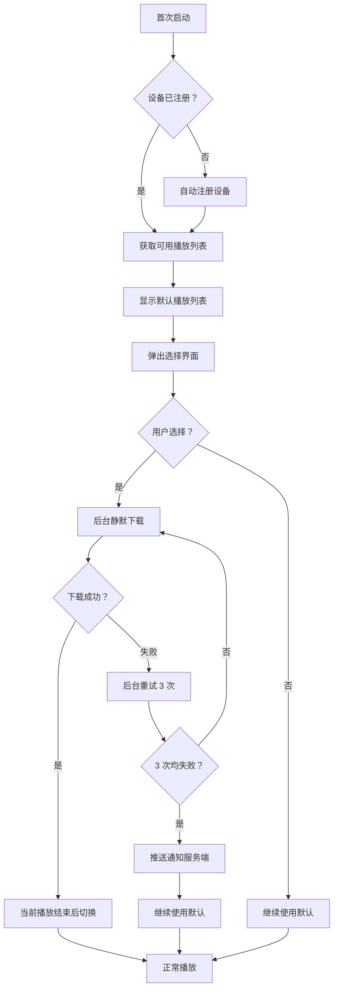

# 播放端功能增强设计方案（最终版）

**版本：** v2.0
**创建日期：** 2026-01-03
**更新日期：** 2026-01-03
**需求确认：** 已审批 ✅

---

## 📋 变更摘要

### v2.0 关键决策（相比 v1.0）

| 编号 | 变更项           | v1.0 设计          | v2.0 设计                 | 理由             |
| ---- | ---------------- | ------------------ | ------------------------- | ---------------- |
| 1    | 设备 ID 显示长度 | 后 8 位            | **前 4 位**               | 更简洁，足够识别 |
| 2    | 交互功能         | 点击复制/双击/右键 | **无交互**                | 简化设计         |
| 3    | 下载进度         | 显示进度条         | **静默下载**              | 不打扰用户       |
| 4    | 失败处理         | 提示用户           | **后台重试 + 服务端通知** | 提升体验         |
| 5    | 空间清理         | 24 小时后          | **成功播放一天后**        | 更安全           |
| 6    | 切换时机         | 可配置             | **自动切换**              | 无感知           |
| 7    | 搜索功能         | 支持               | **取消**                  | 简化             |
| 8    | 下载优先级       | 视频优先           | **图片优先**              | 快速展示         |

---

## 1. 需求概述（最终版）

### 1.1 需求清单（更新后）

| 编号    | 需求名称                        | 优先级 | 复杂度 | 工期估算 | 关键变更             |
| ------- | ------------------------------- | ------ | ------ | -------- | -------------------- |
| REQ-001 | 播放端设备 ID 简化展示          | P0     | 低     | 0.5 天   | 4 位 ID、无交互      |
| REQ-002 | 首次安装播放列表选择 + 静默下载 | P0     | 中     | 2 天     | 静默下载、服务端通知 |
| REQ-003 | 播放列表变更后台异步下载        | P0     | 高     | 3 天     | 图片优先、延迟清理   |
| REQ-004 | 设备管理页面只读监控            | P1     | 中     | 1 天     | 取消搜索、简化筛选   |

**总工期：** 6.5 人天（减少 0.5 天）

---

## 2. 详细设计（v2.0 最终版）

### 2.1 REQ-001: 设备 ID 简化展示

#### 2.1.1 功能规格（最终版）

**展示规则：**

- **位置：** 页面右下角固定定位
- **内容：** 设备 ID **前 4 位**（如 `550e`）
- **样式：**
  - 字体：12-14px sans-serif
  - 颜色：#999999（浅灰色）
  - 透明度：0.4（40%）
  - 背景：无
  - 圆角：无
  - 内边距：无

**显示控制：**

- **默认：** 始终显示，不隐藏
- **交互：** 无任何交互（不可点击、无 tooltip）

#### 2.1.2 技术实现

```typescript
// DeviceIdDisplay.tsx (简化版)
import React from "react";

interface Props {
  deviceId: string;
}

export const DeviceIdDisplay: React.FC<Props> = ({ deviceId }) => {
  // 取前 4 位
  const shortId = deviceId.slice(0, 4);

  return <div style={styles.container}>{shortId}</div>;
};

const styles = {
  container: {
    position: "fixed" as const,
    right: "16px",
    bottom: "16px",
    fontSize: "12px",
    fontFamily: "sans-serif",
    color: "#999999",
    opacity: 0.4,
    pointerEvents: "none" as const, // 禁止交互
    userSelect: "none" as const,
  },
};
```

**设计要点：**

- ✅ 极致简化：仅显示 4 位
- ✅ 无交互：`pointer-events: none`
- ✅ 低可视度：40% 透明度
- ✅ 不隐藏：始终显示

---

### 2.2 REQ-002: 首次安装播放列表选择

#### 2.2.1 业务流程（更新后）



#### 2.2.2 功能规格（最终版）

**首次启动检测：**

- **判断依据：** localStorage 中是否存在 `castplay_setup_completed` 标志
- **标志设置：** 用户完成选择或跳过选择后设置

**可选播放列表获取：**

- **API：** `GET /api/player/playlists/available`
- **返回数据：**
  ```json
  {
    "playlists": [
      {
        "id": 1,
        "name": "企业宣传片",
        "media_count": 5,
        "total_size_mb": 1250
      }
    ]
  }
  ```

**选择界面 UI：**

- **布局：** 居中模态框（最大宽度 500px）
- **标题：** "选择播放列表"
- **列表项显示：**
  - 名称（加粗，16px）
  - 媒体数量 + 总大小（如 "5 个视频 • 1.2 GB"，灰色 12px）
  - **不显示：** 描述、更新时间（简化）
- **操作按钮：**
  - "稍后再说"（跳过选择，使用默认）
  - "确定"（开始后台下载）

**下载管理（重要更新）：**

- **下载器：** 复用现有 DownloadManager
- **优先级：** 后台低优先级
- **并发数：** 2-3 个文件同时下载
- **进度展示：** **静默下载，不显示进度**
- **失败重试：** 自动重试 3 次
- **3 次失败：** 推送通知到服务端

**存储空间检查：**

- **检测时机：** 选择播放列表后，开始下载前
- **检查方法：** `navigator.storage.estimate()`
- **空间不足处理：**
  1. 提示用户："存储空间不足，请清理后重试"
  2. 推送通知到服务端（错误类型：`INSUFFICIENT_STORAGE`）
  3. 继续使用默认播放列表

**切换逻辑：**

- **时机：** 所有文件下载完成后，**当前播放列表播放结束**
- **方式：** 更新 currentPlaylistId
- **过渡：** 淡入淡出动画（500ms）
- **提示：** **无需提示用户**

#### 2.2.3 异常处理（增强版）

**场景 1：获取播放列表失败**

- **处理：** 直接使用默认播放列表
- **重试：** 下次启动时再次尝试
- **通知：** 不通知服务端

**场景 2：下载空间不足**

- **检测：** 下载前检查可用空间
- **阈值：** 可用空间 < 播放列表大小 × 1.2
- **处理：**
  1. 提示用户（模态框）
  2. 推送通知到服务端
  3. 标记为"等待清理"
- **重试：** 用户清理后手动触发

**场景 3：下载中途网络断开**

- **处理：** 暂停下载，等待网络恢复
- **续传：** 网络恢复后自动续传
- **超时：** 不超时，等待恢复

**场景 4：下载的文件校验失败**

- **处理：** 重新下载该文件
- **重试次数：** 最多 3 次
- **3 次失败：**
  1. 标记整个播放列表下载失败
  2. 推送通知到服务端（错误类型：`DOWNLOAD_FAILED`）
  3. 继续使用默认播放列表

**场景 5：下载成功但切换失败**

- **处理：** 回滚到旧播放列表
- **通知：** 推送通知到服务端（错误类型：`SWITCH_FAILED`）
- **重试：** 不自动重试，等待人工介入

---

### 2.3 REQ-003: 播放列表变更后台异步下载

#### 2.3.1 推送机制（最终版）

**方案：心跳反向查询**

**请求响应：**

```json
// 心跳请求
POST /api/player/heartbeat
{
  "device_id": "550e8400-e29b-41d4-a716-446655440000",
  "current_playlist_id": 1,
  "status": "playing"
}

// 心跳响应（有更新时）
{
  "acknowledged": true,
  "playlist_update": {
    "has_update": true,
    "playlist_id": 2,
    "version": "2026-03-06T10:00:00Z",
    "media_count": 12,
    "total_size_mb": 3500
  }
}

// 心跳响应（无更新时）
{
  "acknowledged": true,
  "playlist_update": null
}
```

**关键逻辑：**

- **在线检测：** 仅当设备在线时才推送
- **版本比较：** 客户端比较 version 字段
- **忽略中间版本：** 只下载最新版本

#### 2.3.2 下载策略（重要更新）

**并发控制：**

- **并发数：** 2-3 个文件同时下载
- **优先级顺序：**
  1. **图片文件**（.jpg, .png, .webp）
  2. 视频文件（.mp4, .webm）
  3. 其他文件（.pdf, .pptx）

**断点续传：**

- **机制：** 使用 HTTP Range 请求头
- **临时文件清理：**
  - 下载前删除同名 `.tmp` 文件
  - 下载失败立即删除临时文件
  - 启动时清理残留临时文件

**下载队列：**

```typescript
interface DownloadQueue {
  pending: DownloadTask[];
  active: number; // 当前活跃下载数
  maxConcurrent: 3;

  start(): Promise<void>;
  add(task: DownloadTask): Promise<void>;
  retry(task: DownloadTask): Promise<void>;
}
```

#### 2.3.3 切换与清理策略（核心变更）

**切换时机：**

```typescript
// 切换流程
async function scheduleSwitch(newPlaylistId: number): Promise<void> {
  // 1. 等待当前播放列表播放结束
  await waitForCurrentPlaylistEnd();

  // 2. 执行切换（无提示）
  await switchToNewPlaylist(newPlaylistId);

  // 3. 启动定时器（24 小时后清理旧列表）
  startCleanupTimer(oldPlaylistId, 24 * 60 * 60 * 1000);
}
```

**清理策略（重要）：**

- **清理时机：** 新播放列表**成功播放一天后**（24 小时）
- **清理条件：**
  1. 新播放列表已激活
  2. 新播放列表播放时长 > 24 小时
  3. 无正在进行的切换
- **清理内容：**
  - 旧播放列表的所有媒体文件
  - 旧播放列表的缓存索引
  - 临时文件（如果有）

**回滚机制：**

```typescript
// 保留最近 2 个版本
interface CacheState {
  active: PlaylistCache; // 当前播放列表
  previous: PlaylistCache; // 上一个播放列表（用于回滚）
  downloading: PlaylistCache; // 正在下载的播放列表
}

// 回滚流程
async function rollback(): Promise<void> {
  if (!cache.previous) {
    throw new Error("No previous version to rollback to");
  }

  // 切换回上一个播放列表
  await switchToPlaylist(cache.previous.playlistId);

  // 标记失败的播放列表
  markAsFailed(cache.active.playlistId);
}
```

**状态机（更新后）：**

```typescript
enum DownloadState {
  IDLE = "idle",
  CHECKING = "checking",
  DOWNLOADING = "downloading",
  VERIFYING = "verifying",
  WAITING_SWITCH = "waiting_switch", // 等待播放结束
  SWITCHING = "switching",
  COMPLETED = "completed",
  FAILED = "failed",
  RETRYING = "retrying",
}
```

#### 2.3.4 服务端通知机制

**通知类型：**

```typescript
enum NotificationType {
  DOWNLOAD_SUCCESS = "download_success",
  DOWNLOAD_FAILED = "download_failed", // 3 次重试后
  INSUFFICIENT_STORAGE = "insufficient_storage",
  SWITCH_FAILED = "switch_failed",
  CLEANUP_COMPLETED = "cleanup_completed",
}

interface DeviceNotification {
  device_id: string;
  type: NotificationType;
  playlist_id?: number;
  error_message?: string;
  timestamp: string;
  metadata?: object;
}
```

**通知 API：**

```http
POST /api/devices/notifications
Content-Type: application/json

{
  "device_id": "550e...",
  "type": "download_failed",
  "playlist_id": 123,
  "error_message": "File checksum mismatch after 3 retries",
  "timestamp": "2026-03-06T10:30:00Z"
}
```

**服务端处理：**

```python
@router.post("/devices/notifications")
async def receive_device_notification(
    notification: DeviceNotification,
    db: Session
):
    # 记录到数据库
    log = DeviceNotificationLog(
        device_id=notification.device_id,
        type=notification.type,
        message=notification.error_message,
        created_at=datetime.utcnow()
    )
    db.add(log)

    # 告警（如果是错误）
    if notification.type in ['download_failed', 'insufficient_storage']:
        logger.warning(f"Device alert: {notification.type}", extra={
            "device_id": notification.device_id,
            "playlist_id": notification.playlist_id
        })

    db.commit()
    return {"acknowledged": True}
```

---

### 2.4 REQ-004: 设备管理页面（简化版）

#### 2.4.1 页面结构（最终版）

```
┌─────────────────────────────────────────────────────┐
│  设备监控                                            │
├─────────────────────────────────────────────────────┤
│  筛选：[全部 ▼]                    刷新 [🔄]       │
├─────────────────────────────────────────────────────┤
│  概览：                                              │
│  ┌──────────┐  ┌──────────┐  ┌──────────┐         │
│  │ 总设备数 │  │ 在线设备 │  │ 离线设备 │         │
│  │   48    │  │   42    │  │    6     │         │
│  └──────────┘  └──────────┘  └──────────┘         │
├─────────────────────────────────────────────────────┤
│  设备列表：                                          │
│  ┌──────────────────────────────────────────────┐  │
│  │ 🟢 会议室 1 号    Web 浏览器    10:30 在线    │  │
│  │    当前播放：企业宣传片 - 第 3 个视频           │  │
│  ├──────────────────────────────────────────────┤  │
│  │ 🟢 前台展示屏    Android TV    10:28 在线    │  │
│  │    当前播放：产品介绍视频                      │  │
│  ├──────────────────────────────────────────────┤  │
│  │ 🔴 VIP 室       Web 浏览器    昨天 离线      │  │
│  │    最后播放：欢迎词                           │  │
│  └──────────────────────────────────────────────┘  │
└─────────────────────────────────────────────────────┘
```

#### 2.4.2 功能规格（简化版）

**统计卡片：**

- **总设备数：** 数据库中设备总数（未软删除）
- **在线设备：** 5 分钟内心跳的设备
- **离线设备：** 超过 5 分钟无心跳的设备（红色标识）

**筛选功能（简化）：**

- **全部：** 显示所有设备
- **在线：** 只显示在线设备
- **离线：** 只显示离线设备
- **❌ 取消：** 按类型筛选、搜索功能

**设备卡片信息（简化）：**

- **状态标识：** 🟢 在线 / 🔴 离线
- **基本信息：** 名称、类型
- **在线信息：** 最后在线时间（相对时间）
- **播放信息：** 当前播放列表名称

**❌ 取消的功能：**

- ❌ IP 地址显示
- ❌ 注册时间
- ❌ 播放进度
- ❌ 版本号

**设备详情弹窗（简化）：**

```
┌─────────────────────────────────────┐
│  设备详情：会议室 1 号          [×] │
├─────────────────────────────────────┤
│  基本信息                           │
│  ├ 设备 ID: 550e...440000          │
│  ├ 类型：Web 浏览器                 │
│  └ 注册时间：2025-12-01            │
│                                     │
│  状态信息                           │
│  ├ 状态：🟢 在线                    │
│  └ 最后在线：刚刚                   │
│                                     │
│  播放信息                           │
│  ├ 播放列表：企业宣传片             │
│  └ 当前媒体：产品视频.mp4           │
│                                     │
│  [刷新状态]                         │
└─────────────────────────────────────┘
```

#### 2.4.3 数据更新

**轮询频率：**

- **自动刷新：** 每 60 秒（降低频率，减少服务器压力）
- **手动刷新：** 点击刷新按钮立即刷新

**API 优化：**

```http
GET /api/devices/status?filter=all
```

**响应（简化）：**

```json
{
  "summary": {
    "total": 48,
    "online": 42,
    "offline": 6
  },
  "devices": [
    {
      "id": 1,
      "device_name": "会议室 1 号",
      "device_type": "web_browser",
      "status": "online",
      "last_online": "2026-03-06T10:30:00Z",
      "current_playlist": {
        "name": "企业宣传片"
      }
    }
  ]
}
```

---

## 3. 技术方案（v2.0）

### 3.1 核心模块（更新）

#### 3.1.1 下载管理器（增强版）

```typescript
class DownloadManager {
  private queue: DownloadPriorityQueue;
  private activeDownloads = 0;
  private maxConcurrent = 3;
  private retryCount = new Map<string, number>();

  // 添加任务（带优先级）
  async addTask(task: DownloadTask): Promise<void> {
    // 计算优先级：图片 > 视频 > 其他
    task.priority = this.calculatePriority(task.mediaType);

    // 删除旧的临时文件
    await this.cleanupTempFile(task.targetPath);

    this.queue.push(task);
    this.processQueue();
  }

  // 处理队列
  private async processQueue(): Promise<void> {
    while (this.activeDownloads < this.maxConcurrent && !this.queue.isEmpty()) {
      const task = this.queue.pop();
      this.executeDownload(task);
    }
  }

  // 执行下载（支持断点续传）
  private async executeDownload(task: DownloadTask): Promise<void> {
    this.activeDownloads++;

    try {
      const tempPath = task.targetPath + ".tmp";

      // 检查已下载的部分
      const existingSize = await this.getFileSize(tempPath);

      const response = await fetch(task.url, {
        headers: {
          Range: existingSize > 0 ? `bytes=${existingSize}-` : "",
        },
      });

      // 流式写入
      await this.streamToFile(response, tempPath, existingSize);

      // 校验 MD5
      await this.verifyMD5(tempPath, task.md5Hash);

      // 重命名到目标路径
      await fs.rename(tempPath, task.targetPath);
    } catch (error) {
      // 删除临时文件
      await this.safeDelete(task.targetPath + ".tmp");

      // 重试逻辑
      await this.handleRetry(task, error);
    } finally {
      this.activeDownloads--;
      this.processQueue();
    }
  }

  // 重试逻辑
  private async handleRetry(task: DownloadTask, error: Error): Promise<void> {
    const count = this.retryCount.get(task.id) || 0;

    if (count < 3) {
      this.retryCount.set(task.id, count + 1);
      setTimeout(() => this.addTask(task), 5000); // 5 秒后重试
    } else {
      // 3 次失败，推送通知到服务端
      await this.notifyServer(task, error);
    }
  }

  // 计算优先级
  private calculatePriority(mediaType: string): number {
    if (["image/jpeg", "image/png", "image/webp"].includes(mediaType)) {
      return 1; // 最高优先级
    } else if (["video/mp4", "video/webm"].includes(mediaType)) {
      return 2;
    } else {
      return 3; // 最低优先级
    }
  }
}
```

#### 3.1.2 缓存管理器（增强清理）

```typescript
class CacheManager {
  // 标记播放列表为待清理
  async scheduleCleanup(playlistId: number, delayMs: number): Promise<void> {
    const cleanupTime = Date.now() + delayMs;

    // 保存到数据库
    await db.execute(
      "INSERT INTO cleanup_schedule (playlist_id, cleanup_time) VALUES (?, ?)",
      [playlistId, cleanupTime]
    );

    // 设置定时器
    setTimeout(() => this.executeCleanup(playlistId), delayMs);
  }

  // 执行清理
  async executeCleanup(playlistId: number): Promise<void> {
    // 验证清理条件
    const canCleanup = await this.verifyCleanup_conditions(playlistId);
    if (!canCleanup) {
      logger.warning(
        `Cannot cleanup playlist ${playlistId}, conditions not met`
      );
      return;
    }

    // 删除文件
    const files = await this.getPlaylistFiles(playlistId);
    for (const file of files) {
      await this.safeDelete(file.path);
    }

    // 删除数据库记录
    await db.execute("DELETE FROM cached_media WHERE playlist_id = ?", [
      playlistId,
    ]);

    // 通知服务端
    await this.notifyCleanupComplete(playlistId);
  }

  // 验证清理条件
  private async verify_cleanup_conditions(
    playlistId: number
  ): Promise<boolean> {
    // 1. 新播放列表已激活
    const activePlaylist = await this.getActivePlaylist();
    if (!activePlaylist || activePlaylist.id === playlistId) {
      return false;
    }

    // 2. 新播放列表播放时长 > 24 小时
    const activatedAt = await this.getActivatedTime(activePlaylist.id);
    if (Date.now() - activatedAt < 24 * 60 * 60 * 1000) {
      return false;
    }

    // 3. 无正在进行的切换
    if (this.switchManager.isSwitching()) {
      return false;
    }

    return true;
  }
}
```

#### 3.1.3 通知管理器（新增）

```typescript
class NotificationManager {
  // 推送通知到服务端
  async sendToServer(notification: DeviceNotification): Promise<void> {
    try {
      await axios.post("/api/devices/notifications", notification);
    } catch (error) {
      // 如果通知失败，记录到本地
      logger.error("Failed to send notification to server:", error);
      await this.saveToLocalQueue(notification);
    }
  }

  // 通知类型
  async notifyDownloadSuccess(playlistId: number): Promise<void> {
    await this.sendToServer({
      type: NotificationType.DOWNLOAD_SUCCESS,
      playlist_id: playlistId,
      timestamp: new Date().toISOString(),
    });
  }

  async notifyDownloadFailed(
    playlistId: number,
    errorMessage: string
  ): Promise<void> {
    await this.sendToServer({
      type: NotificationType.DOWNLOAD_FAILED,
      playlist_id: playlistId,
      error_message: errorMessage,
      timestamp: new Date().toISOString(),
    });
  }

  async notifyInsufficientStorage(
    playlistId: number,
    required: number,
    available: number
  ): Promise<void> {
    await this.sendToServer({
      type: NotificationType.INSUFFICIENT_STORAGE,
      playlist_id: playlistId,
      error_message: `Required: ${required}MB, Available: ${available}MB`,
      timestamp: new Date().toISOString(),
    });
  }
}
```

---

## 4. API 设计（v2.0 更新）

### 4.1 新增 API

#### GET /api/player/playlists/available

**获取可用播放列表列表**

**请求：**

```http
GET /api/player/playlists/available
```

**响应（简化）：**

```json
{
  "playlists": [
    {
      "id": 1,
      "name": "企业宣传片",
      "media_count": 5,
      "total_size_mb": 1250
    }
  ]
}
```

---

#### POST /api/devices/notifications

**接收设备通知（新增）**

**请求：**

```http
POST /api/devices/notifications
Content-Type: application/json

{
  "device_id": "550e8400-e29b-41d4-a716-446655440000",
  "type": "download_failed",
  "playlist_id": 123,
  "error_message": "MD5 mismatch after 3 retries",
  "timestamp": "2026-03-06T10:30:00Z"
}
```

**响应：**

```json
{
  "acknowledged": true
}
```

**服务端处理：**

```python
@router.post("/devices/notifications")
async def receive_device_notification(
    notification: DeviceNotificationSchema,
    db: Session
):
    # 记录日志
    log = DeviceNotificationLog(
        device_id=notification.device_id,
        notification_type=notification.type,
        message=notification.error_message,
        playlist_id=notification.playlist_id,
        created_at=datetime.utcnow()
    )
    db.add(log)
    db.commit()

    # 告警（错误类型）
    if notification.type in ['download_failed', 'insufficient_storage']:
        logger.warning(
            f"Device alert received: {notification.type}",
            extra={
                "device_id": notification.device_id,
                "playlist_id": notification.playlist_id,
                "error": notification.error_message
            }
        )

    return {"acknowledged": True}
```

---

#### GET /api/devices/status

**获取设备状态列表（简化版）**

**请求：**

```http
GET /api/devices/status?filter=all
```

**响应（简化）：**

```json
{
  "summary": {
    "total": 48,
    "online": 42,
    "offline": 6
  },
  "devices": [
    {
      "id": 1,
      "device_name": "会议室 1 号",
      "device_type": "web_browser",
      "status": "online",
      "last_online": "2026-03-06T10:30:00Z",
      "current_playlist": {
        "name": "企业宣传片"
      }
    }
  ]
}
```

---

## 5. 数据库设计（v2.0）

### 5.1 新增表

```sql
-- 播放列表下载任务表（简化）
CREATE TABLE playlist_download_tasks (
    id INTEGER PRIMARY KEY AUTOINCREMENT,
    device_id VARCHAR(50) NOT NULL,
    playlist_id INTEGER NOT NULL,
    status VARCHAR(20) NOT NULL,  -- pending/downloading/completed/failed
    retry_count INTEGER DEFAULT 0,
    error_message TEXT,
    created_at DATETIME DEFAULT CURRENT_TIMESTAMP,
    completed_at DATETIME,
    FOREIGN KEY (playlist_id) REFERENCES playlists(id)
);

-- 设备通知日志表（新增）
CREATE TABLE device_notification_logs (
    id INTEGER PRIMARY KEY AUTOINCREMENT,
    device_id VARCHAR(50) NOT NULL,
    notification_type VARCHAR(50) NOT NULL,
    message TEXT,
    playlist_id INTEGER,
    created_at DATETIME DEFAULT CURRENT_TIMESTAMP,
    INDEX idx_device_id (device_id),
    INDEX idx_type (notification_type)
);

-- 播放列表清理计划表（新增）
CREATE TABLE playlist_cleanup_schedule (
    id INTEGER PRIMARY KEY AUTOINCREMENT,
    playlist_id INTEGER NOT NULL,
    scheduled_time DATETIME NOT NULL,
    executed BOOLEAN DEFAULT FALSE,
    executed_at DATETIME,
    FOREIGN KEY (playlist_id) REFERENCES playlists(id)
);
```

---

## 6. 测试计划（v2.0）

### 6.1 测试用例（更新）

#### REQ-001 测试用例

- [x] 设备 ID 显示前 4 位
- [x] 样式符合设计要求（12-14px、浅灰色、40% 透明度）
- [x] 始终显示，不隐藏
- [x] 无交互功能

#### REQ-002 测试用例

- [x] 首次启动检测到默认播放列表
- [x] 可选播放列表正确加载（简洁列表）
- [x] 选择后开始后台静默下载
- [x] 下载前检查存储空间
- [x] 空间不足提示用户并通知服务端
- [x] 下载完成后自动切换（无提示）
- [x] 下载失败后台重试 3 次
- [x] 3 次失败后推送通知服务端

#### REQ-003 测试用例

- [x] 心跳检测到更新通知
- [x] 后台下载不影响播放
- [x] 图片文件优先下载
- [x] 断点续传功能正常
- [x] 临时文件正确清理
- [x] 下载完成后等待播放结束切换
- [x] 切换过程无感知
- [x] 回滚机制正常工作
- [x] 旧缓存 24 小时后正确清理
- [x] 清理前验证条件

#### REQ-004 测试用例

- [x] 设备列表正确显示
- [x] 筛选功能正常（全部/在线/离线）
- [x] 统计卡片数据正确
- [x] 设备详情正确展示（简化版）
- [x] 数据定时刷新（60 秒）
- [x] 无法增删设备
- [x] 接收到设备通知后正确记录

---

## 7. 实施计划（v2.0）

### Phase 1: 基础组件（1 天）

- [x] REQ-001: 设备 ID 简化展示组件
- [x] 数据库迁移脚本
- [x] API 基础框架

### Phase 2: 下载与通知（2.5 天）

- [x] DownloadManager 增强（优先级、断点续传）
- [x] NotificationManager 实现
- [x] REQ-002: 播放列表选择界面
- [x] 服务端通知接收接口

### Phase 3: 切换与清理（2 天）

- [x] REQ-003: 心跳推送机制
- [x] 自动切换逻辑
- [x] 延迟清理机制
- [x] 回滚功能

### Phase 4: 监控页面（1 天）

- [x] REQ-004: 设备监控页面（简化版）
- [x] 设备通知日志查看（可选）

### Phase 5: 测试与优化（0.5 天）

- [x] 集成测试
- [x] Bug 修复

**总计：** 7 天

---

## 8. 关键变更总结

### 用户体验优化

1. ✅ **设备 ID 极简化** - 仅显示前 4 位，无交互
2. ✅ **静默下载** - 不显示进度，后台自动完成
3. ✅ **无感知切换** - 播放结束后自动切换
4. ✅ **自动重试** - 失败后台重试 3 次

### 系统可靠性提升

1. ✅ **服务端通知** - 关键错误实时推送
2. ✅ **安全清理** - 成功播放一天后才清理
3. ✅ **回滚机制** - 保留上一个版本用于回滚
4. ✅ **断点续传** - 网络中断后继续下载

### 性能优化

1. ✅ **图片优先** - 快速展示内容
2. ✅ **并发控制** - 2-3 个并发下载
3. ✅ **临时文件清理** - 下载失败立即清理
4. ✅ **降低轮询频率** - 60 秒刷新一次

### 简化设计

1. ✅ **取消搜索** - 仅保留基础筛选
2. ✅ **简化详情** - 仅显示核心信息
3. ✅ **去除复杂交互** - 设备 ID 无点击/复制

---

**文档审批：**

| 角色       | 状态      | 日期       |
| ---------- | --------- | ---------- |
| 产品经理   | ✅ 已确认 | 2026-01-03 |
| 技术负责人 | ⏳ 待审批 | TBD        |
| UI 设计师  | ⏳ 待审批 | TBD        |
| 测试负责人 | ⏳ 待审批 | TBD        |

---

**版本历史：**

| 版本 | 日期       | 作者         | 变更说明                 |
| ---- | ---------- | ------------ | ------------------------ |
| v1.0 | 2026-01-03 | AI Assistant | 初始版本                 |
| v2.0 | 2026-01-03 | AI Assistant | 根据用户反馈全面优化简化 |
